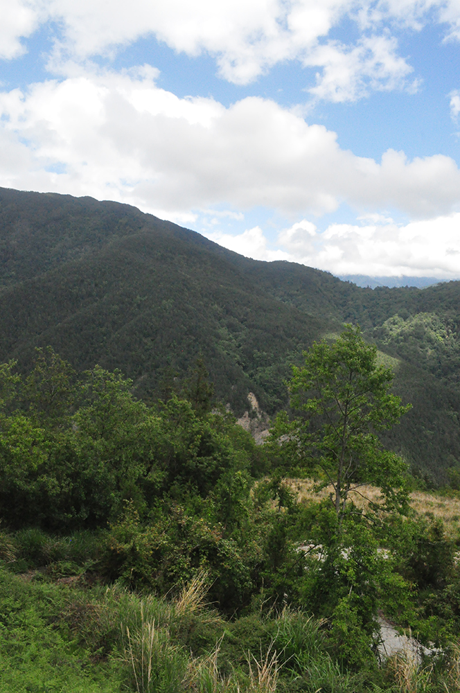
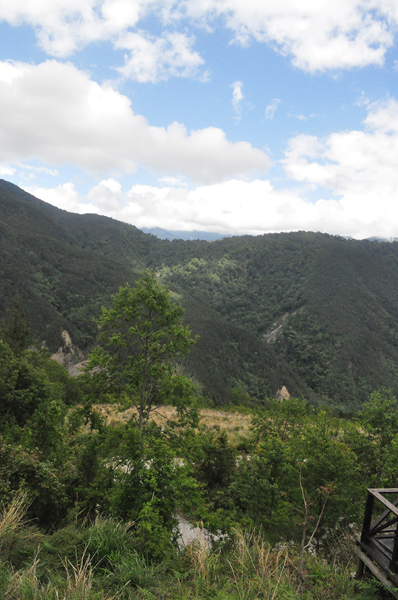
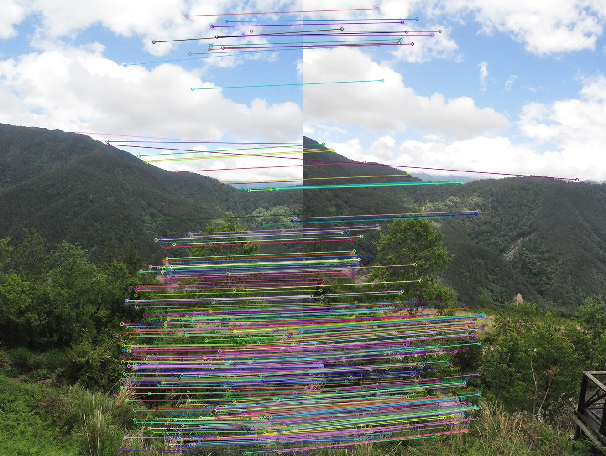
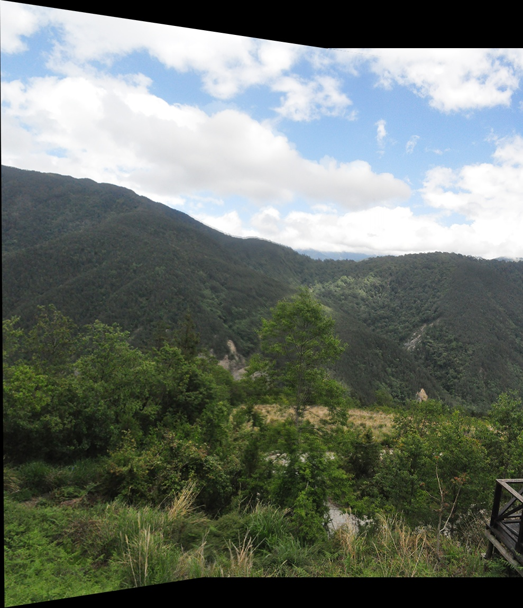

# Image Stitching using SIFT

This project provides a universal Python tool to stitch two partially overlapping images into a single panoramic image using the **SIFT (Scale-Invariant Feature Transform)** algorithm and homography-based perspective warping.

To ensure professional results, the program implements coordinate translation (to prevent image cropping at boundaries) and distance-transform-based feather blending (to create seamless transitions without visible edges).

## Example Results

Here is an example run of the stitching algorithm using the project's default images:

### Original Input Images
We start with two partially overlapping photographs:

| Image 1 (`para11.jpg`) | Image 2 (`para12.jpg`) |
| :---: | :---: |
|  |  |

### Keypoint Matches (`matches.jpg`)
The SIFT algorithm detects keypoints and extracts descriptors. The program then matches them and filters out outliers using RANSAC:



### Final Stitched Panorama (`panorama.jpg`)
The final panorama is composed by warping Image 1 onto the perspective of Image 2. Seamless blending is performed in the overlapping area to remove harsh seams:



---

## Features

- **SIFT Feature Detection**: Robustly detects keypoints and extracts scale- and rotation-invariant descriptors.
- **RANSAC Homography Estimation**: Dynamically calculates the projection matrix while filtering out noise and bad matches.
- **Cropping Prevention**: Projects image corners to calculate the canvas size and applies a translation matrix to prevent clipping.
- **Feather Blending**: Computes normalized distance transforms for overlapping regions to blend pixels smoothly, avoiding hard seams.
- **Universal CLI**: Works on any pair of overlapping images, with custom parameters.
- **Matches Visualization**: Option to save a visual representation of keypoint matching.

## Installation

Ensure you have Python 3 installed. Then, install the required packages:

```bash
pip install -r requirements.txt
```

*Note: Dependencies include `opencv-python` and `numpy`.*

## Usage

### Run with Default Project Images
To stitch the default images `para11.jpg` and `para12.jpg` from the project directory:

```bash
python stitch.py
```

This will output the stitched result to `panorama.jpg`.

### Run with Custom Images
To stitch any other two images, specify the paths via the command-line arguments:

```bash
python stitch.py --img1 path/to/image1.jpg --img2 path/to/image2.jpg --output path/to/output.jpg
```

### Command Line Arguments

| Argument | Type | Default | Description |
| :--- | :--- | :--- | :--- |
| `--img1` | `str` | `para11.jpg` | Path to the first image (the one that will be warped). |
| `--img2` | `str` | `para12.jpg` | Path to the second image (the anchor/base image). |
| `--output` | `str` | `panorama.jpg` | Path to save the final stitched panorama. |
| `--ratio` | `float` | `0.7` | Lowe's ratio test threshold (lower is more strict, standard range is 0.7 - 0.8). |
| `--no-blend` | `flag` | | Disable distance-transform blending and perform a direct merge (helps visualize the seam). |
| `--save-matches` | `str` | `None` | Path to save an image illustrating the keypoint matching (e.g. `matches.jpg`). |

---

## How the Algorithm Works

1. **Grayscale Conversion**: The input images are converted to grayscale for keypoint analysis.
2. **SIFT Feature Detection**: Keypoints and descriptors are extracted using `cv2.SIFT_create()`.
3. **Descriptor Matching**: A Brute-Force Matcher matches descriptors using $k$-nearest neighbors ($k=2$).
4. **Lowe's Ratio Test**: Retains only matches where the distance to the closest neighbor is less than `ratio` times the distance to the second-closest neighbor. This removes false matches.
5. **Homography & RANSAC**: Computes a perspective homography matrix $H$ mapping points from Image 1 to Image 2, rejecting outliers.
6. **Canvas Calculation & Translation**: Projects the corners of Image 1 through $H$. The bounding box of these warped corners and Image 2's corners is calculated. If any corners fall in negative coordinate space, a translation matrix $T$ is applied to shift all coordinates into positive canvas space.
7. **Feather Blending**: In the overlapping area, `cv2.distanceTransform` is run on both image masks. The weights for blending are derived from the relative distance of each pixel to its respective image boundary. This smooths out illumination and alignment transitions.
8. **Borders Cropping**: Trims any outer black padding to return a clean rectangular result.
